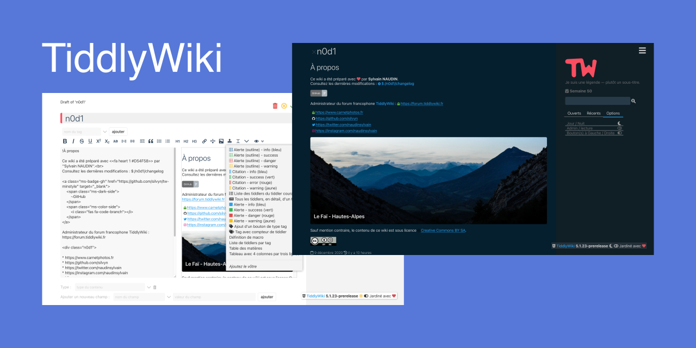

# minstyle-tw
TiddlyWiki with minstyle.io CSS and lot's of love

New project 12/2020 from old one 04/2020 (https://github.com/silvyn/tw-minstyle-old).

Begin with 5.1.23 TiddlyWiki prerelease version.

## minstyle.io

* https://minstyle.io/
* https://github.com/Airmime/minstyle.io

minstyle.io is an open source CSS framework, under MIT licence, created by Rémi MARION

## TiddlyWiki

* https://tiddlywiki.com/
* https://github.com/Jermolene/TiddlyWiki5

TiddlyWiki is a unique non-linear notebook for capturing, organising and sharing complex information.
TiddlyWiki is published under a permissive BSD 3-Clause License
